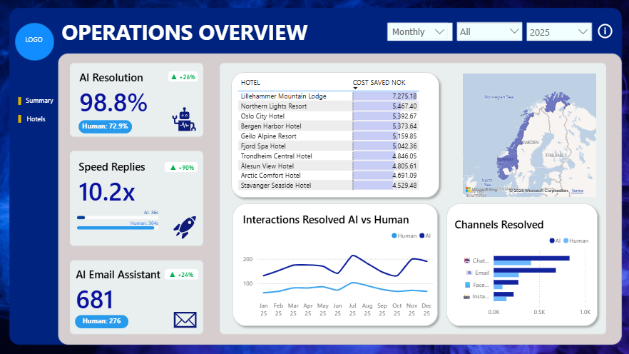
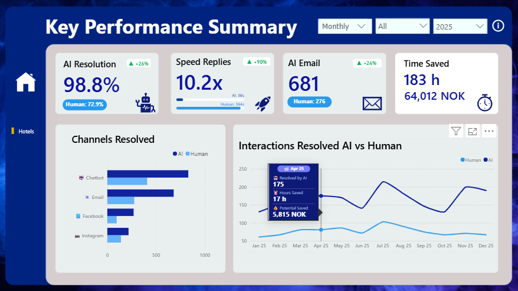
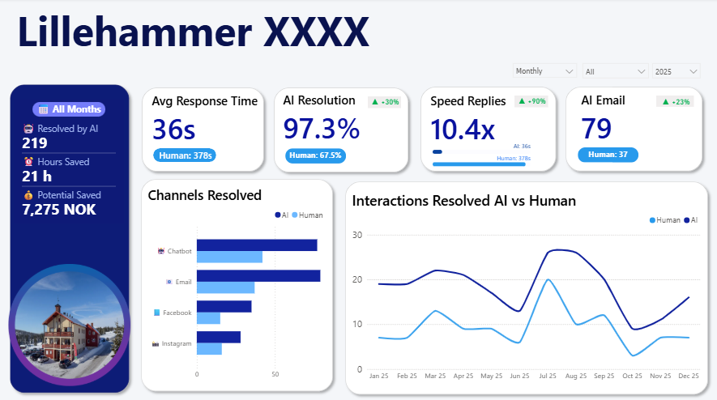

# AI Assistant Operational Impact Analysis in Hotels
### Data Analytics Portfolio Project · Norway 2025


---

## Overview

This project evaluates the operational performance of AI assistants deployed across 10 hotels in Norway during 2025. Drawing on 5,000+ interaction records spanning website chat, email, Instagram, and Facebook, the analysis quantifies automation efficiency, response time improvements, and potential cost savings generated by AI-driven guest support.

> **Disclaimer:** This project was produced independently as part of a personal data analytics portfolio. The dataset is entirely simulated and does not represent actual operational data from any company or its clients. All hotels, interaction records, response times, and derived metrics are fictional.

---

## Key Findings

| KPI | AI | Human |
|-----|-----|-------|
| Resolution Rate | **98.8%** | 72.9% |
| Avg Response Time | **36s** | 396s |
| Speed Advantage | **9.8×** faster | — |
| Fast Responses (<60s) | **79.4%** | 0.1% |
| Throughput Capacity | **100.5 / hr** | 9.1 / hr |

**203 hours saved annually · 64,012 NOK potential cost savings**

---

## Dashboard

### Operations Overview


### Key Performance Summary


### Hotel Detail View


---

## Project Structure

```
AI_Assistant_Hotels/
│
├── SQL_LOAD/               # Data ingestion scripts
├── SQL_CLEAN/              # Data cleaning & validation
├── SQL_ENRICHMENT/         # Feature engineering & enrichment
├── PYTHON_ANALYSIS/        # EDA, statistical analysis & KPI calculation
├── POWER_BI_AI_ANALYSIS/   # Power BI dashboard (.pbix)
├── TXT/                    # Documentation & notes
├── screenshots/            # Dashboard screenshots
│   ├── HOME.png
│   ├── SUMMARY.png
│   └── HOTELS.png
├── DAR_AI_ASSISTANT_HOTELS.pdf   # Full analysis report (PDF)
└── README.md
```

---

## Analytical Workflow

```
SQL  →  Data Cleaning & Validation  →  Data Enrichment & Feature Engineering
     ↓
Python  →  Exploratory Data Analysis  →  Statistical Analysis  →  KPI Calculation
     ↓
Power BI  →  Interactive Dashboard  →  Business Reporting
```

---

## Methodology

- **Data Ingestion:** Monthly CSV batches loaded into pandas DataFrames
- **Data Validation:** Missing values, duplicates, outliers, data type checks
- **Data Cleaning:** 293 duplicate records removed · 17.84% missing language fields imputed
- **Feature Engineering:** Temporal features, hotel size category, response speed tiers
- **KPI Calculation:** Resolution rate, response time improvement, throughput, cost savings
- **Visualisation:** Interactive Power BI dashboard with DAX measures and SVG custom visuals

---

## Tech Stack

| Layer | Tool |
|-------|------|
| Data Processing | SQL (PostgreSQL) |
| Analysis | Python 3 · pandas · numpy · matplotlib · seaborn |
| Notebooks | Jupyter |
| Visualisation | Power BI Desktop |
| Version Control | Git / GitHub |

---

## Strategic Recommendations

1. **Expand AI coverage** for simple & medium complexity cases — 51% of extreme delays occur here
2. **Prioritise AI on website chat** — highest volume channel (43.2%) with most time-sensitive guests
3. **Build seasonal capacity planning** around July, August & November (2.1× baseline volume)
4. **Implement automated data quality monitoring** at ingestion to reduce manual remediation

---

## Author

**Naomi Barranzuela Ali** · Junior Data Analyst  
[[LinkedIn]](#) · [[Email]](#)

---

*This project is part of a personal data analytics portfolio built to demonstrate skills in SQL, Python, and Power BI applied to a real-world hospitality AI use case.*